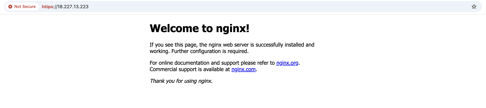

# Practice

# 1. Pre-requisite

In order to eliminate environmental inconsistencies, Docker will be used as a virtualization solution to ensure consistent deployment across any machine.

```bash
# docker version
matt@Cans-MacBook-Pro practice % docker version
Client:
 Version:           28.0.1
 API version:       1.48
 Go version:        go1.23.6
 Git commit:        068a01e
 Built:             Wed Feb 26 10:38:16 2025
 OS/Arch:           darwin/arm64
 Context:           desktop-linux

Server: Docker Desktop 4.39.0 (184744)
 Engine:
  Version:          28.0.1
  API version:      1.48 (minimum version 1.24)
  Go version:       go1.23.6
  Git commit:       bbd0a17
  Built:            Wed Feb 26 10:40:57 2025
  OS/Arch:          linux/arm64
  Experimental:     false
 containerd:
  Version:          1.7.25
  GitCommit:        bcc810d6b9066471b0b6fa75f557a15a1cbf31bb
 runc:
  Version:          1.2.4
  GitCommit:        v1.2.4-0-g6c52b3f
 docker-init:
  Version:          0.19.0
  GitCommit:        de40ad0
```


Clone source code from GitHub

> [!NOTE]
>
> https://github.com/canyang265/public.git


# 2. Setup Virtual Environments 

## 2.1 Create container

```bash
# Host machine
cd public/hantt

# Deploy container
docker-compose up -d 

# Check deployment status
docker ps
CONTAINER ID   IMAGE            COMMAND       CREATED       STATUS                 PORTS     NAMES
3bb1224bba2a   hantt-practice   "/bin/bash"   3 hours ago   Up 3 hours (healthy)             practice
```


## 2.2 Configure AWS credentials

```bash
# Copy EC2 access key to the container
docker cp practice-ec2-key-pair.pem practice:/practice/public/hantt

# Access container
docker exec -it practice bash

# Configure your AWS credential
mkdir -p ~/.aws

cat > ~/.aws/credentials << EOF
[default]
aws_access_key_id = ****************
aws_secret_access_key = ****************
EOF

cat > ~/.aws/config << EOF
[default]
region = us-east-2
EOF
```


# 3. Terraform

## 3.1 Commands

```bash
# current path: /practice
cd public/hantt/terraform

# Initial terraform
terraform init

# Validate configuration
terraform validate

# Format output
terraform fmt

# Check plan
terraform plan

# Apply configuraiton
terraform apply --auto-approve
```


## 3.2 Records

**Terraform Logs**


**VPC created**


**EC2 created**


# 4. Ansible

## 4.1 Commands

```bash
# Current path: /practice/public/hantt/terraform
# Create ansible ec2 inventory file based on EC2 public IP
cat > ../ansible/ec2.ini << EOF
[ec2_servers]
nginx-server ansible_host=$(terraform output -raw ec2_public_ip) ansible_user=ec2-user ansible_ssh_private_key_file=ec2-key-pair.pem

[ec2_servers:vars]
ansible_ssh_common_args='-o StrictHostKeyChecking=no'
EOF

# Grant right privilege to the EC2 access cert file
cd ..
cp practice-ec2-key-pair.pem ansible/ec2-key-pair.pem
chmod 400 ansible/ec2-key-pair.pem

# Current path: /practice/public/hantt/terraform
# Run ansible to install nginx into EC2
cd ansible
ansible-playbook install-nginx.yml -i ec2.ini 
```


## 4.2 Records

**Ansible Logs**


**Nginx Home Page**



**Nginx Certs**


# 5. Packer

## 5.1 Linux Nginx

```bash
# current path: /practice/public/hantt/anisble
cd ../packer/linux

# initialize packer, loading dependencies
packer init .

# validate configuraiton
packer validate nginx-ami.pkr.hcl

# build ami
packer build nginx-ami.pkr.hcl

# initialize terraform
terraform init 

# create ec2 resouece based on built image
terraform apply --auto-approve
```


## 5.2 Records

**packer logs**


**ec2 instance**


**nginx homepage**


## 5.3 Windows Nginx

Something wrong with SSL and Homepage settings on Windows server, need furture troubleshooting.


**packer logs**


**ec2 instance**


**nginx homepage**


